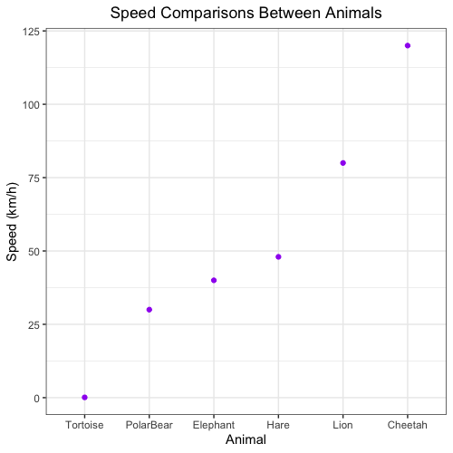
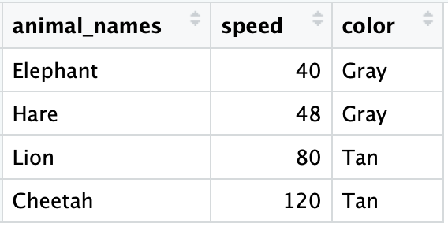

# Day 4 Activities

!!!question "Exercise"
	- Change the `animals` data frame to a tibble called `animals_tb`. Save the row names to a column called `animal_names` before turning it into a tibble.

	{width=400}
	
	- Use ggplot2 to plot the animal names (x-axis) versus the speed of the animal (y-axis) in `animals_tb` using a scatterplot. Customize the plot to display as shown below.

  	{width=425}

	- We decide that our plot would look better with the animal names ordered from slowest to fastest. Using the `animals_tb` tibble, reorder the animals on the x-axis to start with the slowest animal on the left-hand side of the plot to the fastest animal on the right-hand side of the plot by completing the following steps:

		**a.** Use the `arrange()` function to order the rows by speed from slowest to fastest. Then use the `pull()` function to extract the `animal_names` column as a vector of character values. Save the new variable as `names_ordered_by_speed`.

		**b.** Turn the `animal_names` column of `animals_tb` into a factor and specify the levels as `names_ordered_by_speed` from slowest to fastest (output in part a). Note: this step is crucial, because ggplot2 uses `factor` as plotting order, instead of the order we observe in data frame.
	
		**c.** Re-plot the scatterplot with the animal names in order from slowest to fastest.
	
	
  	{width=425}
	
	
	> Note: If you are interested in exploring other ways to reorder a variable in ggplot2, refer to this [post](https://www.r-graph-gallery.com/267-reorder-a-variable-in-ggplot2.html).
	
	- Save the plot as a PDF called `animals_by_speed_scatterplot.pdf ` to the `results` folder.

	- Use the functions from the `dplyr` package to perform the following tasks:

		**a.** Extract the rows of `animals_tb` tibble with color of gray or tan, order the rows based from slowest to fastest speed, and save to a variable called `animals_gray_tan`.
		
		**b.** Save `animals_gray_tan` as a comma-separated value file called `animals_tb_ordered.csv` to the `results` folder.	
	
  	{width=300}
		
		
<details>
    <summary markdown='span'>
        <b>Solution
</b></summary>
	```r
	#1. Change the animals data frame to a tibble called animals_tb. Save the row names to a column called animal_names before turning it into a tibble.
	animals_tb <- animals %>%
        rownames_to_column(var = "animal_names") %>%
        as_tibble()

	#2. Use ggplot2 to plot the animal names (x-axis) versus the speed of the animal (y-axis) in animals_tb using a scatterplot. Customize the plot to display as shown below.
	ggplot(animals_tb) +
        geom_point(aes(x = animal_names, y = speed), color = "purple") +
        theme_bw() +
        ggtitle("Speed Comparisons Between Animals") + 
        ylab("Speed (km/h)") +
        xlab("Animal") +
        theme(plot.title=element_text(hjust=0.5))

	#3. We decide that our plot would look better with the animal names ordered from slowest to fastest. Using the animals_tb tibble, reorder the animals on the x-axis to start with the slowest animal on the left-hand side of the plot to the fastest animal on the right-hand side of the plot by completing the following steps:

	#a. Use the `arrange()` function to order the rows by speed from slowest to fastest. Then use the `pull()` function to extract the `animal_names` column as a vector of character values. Save the new variable as `names_ordered_by_speed`.

	names_ordered_by_speed <- animals_tb %>% arrange(speed) %>% pull(animal_names)
	
	#b. Turn the `animal_names` column of `animals_tb` into a factor and specify the levels as `names_ordered_by_speed` from slowest to fastest (output in part a). Note: this step is crucial, because ggplot2 uses `factor` as plotting order, instead of the order we observe in data frame.
	animals_tb$animal_names <- factor(animals_tb$animal_names, 
                                  levels = names_ordered_by_speed)

	#c. Re-plot the scatterplot with the animal names in order from slowest to fastest.
	ggplot(animals_tb) +
        geom_point(aes(x = animal_names, y = speed), color = "purple") +
        theme_bw() +
        ggtitle("Speed Comparisons Between Animals") + 
        ylab("Speed (km/h)") +
        xlab("Animal") +
        theme(plot.title=element_text(hjust=0.5))

	#4. Save the plot as a PDF called animals_by_speed_scatterplot.pdf to the results folder.
	pdf("results/animals_by_speed_scatterplot.pdf")

	ggplot(animals_tb) +
        geom_point(aes(x = animal_names, y = speed), color = "purple") +
        theme_bw() +
        ggtitle("Speed Comparisons Between Animals") + 
        ylab("Speed (km/h)") +
        xlab("Animal") +
        theme(plot.title=element_text(hjust=0.5))

	dev.off()

	#5. Use the functions from the dplyr package to perform the following tasks:

	#a. Extract the rows of animals_tb tibble with color of gray or tan, order the rows based from slowest to fastest speed, and save to a variable called animals_gray_tan.

	animals_gray_tan <- animals_tb %>% 
        filter(color == "Gray" | color == "Tan") %>%
        arrange(speed)

	#b. Save animals_gray_tan as a comma-separated value file called animals_tb_ordered.csv to the results folder.

	write.csv(animals_gray_tan,
          file = "results/animals_tb_ordered.csv",
          quote = FALSE)
	```